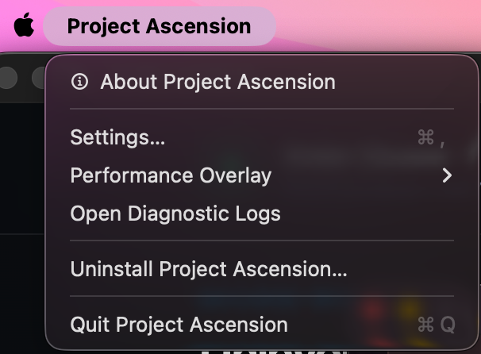
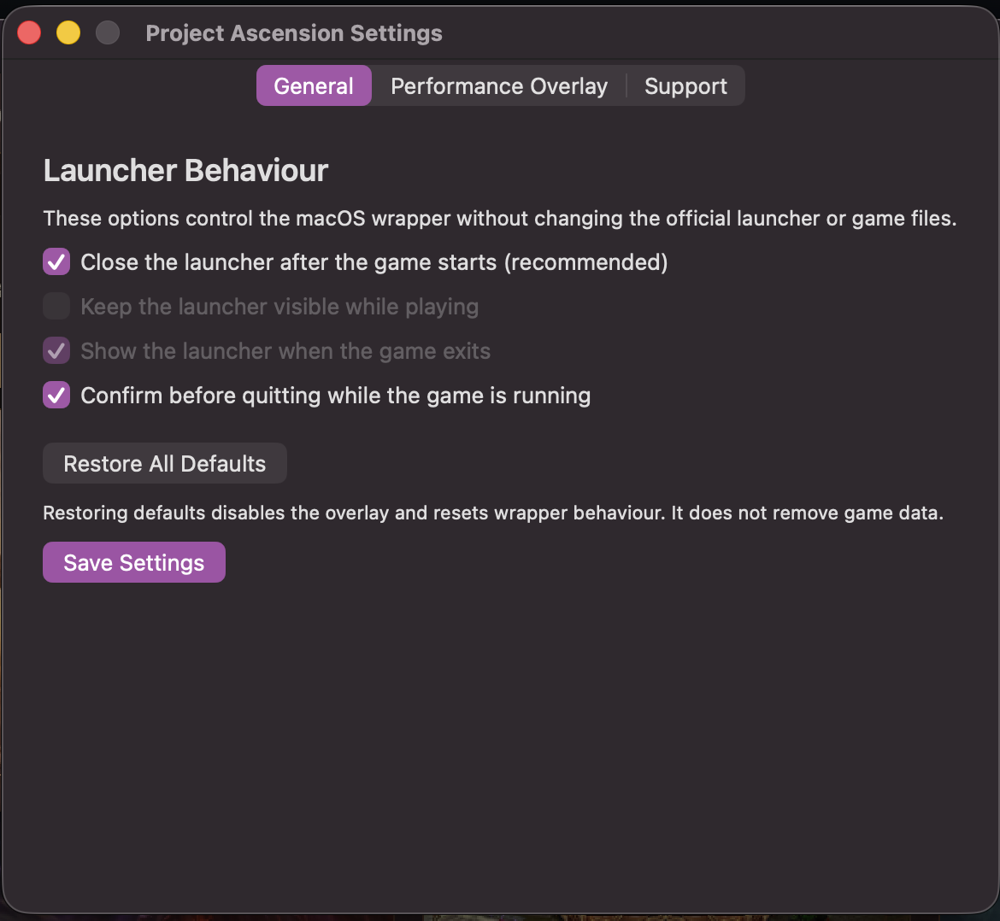
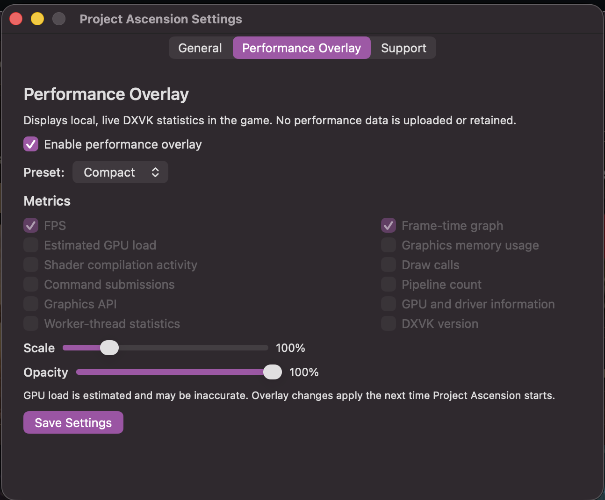
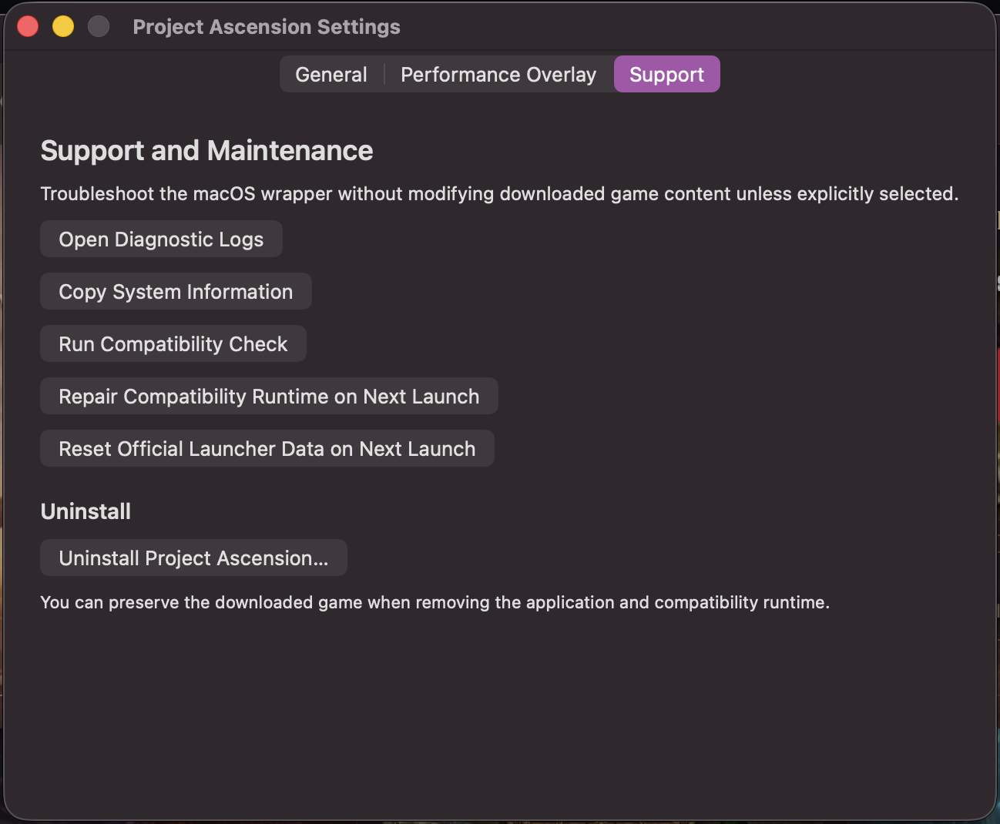

# Project Ascension for Apple Silicon Macs

A standalone macOS application for running Project Ascension on Apple Silicon.
It bundles the tested compatibility runtime, downloads the official Ascension
Launcher directly from Ascension on first launch, then keeps the launcher, game,
settings, repairs, and uninstall flow in one native app. Heroic is not required
for the DMG installation.

> [!IMPORTANT]
> **Unofficial third-party project.** This project is independent and is not
> affiliated with, endorsed by, sponsored by, authorized by, or supported by
> Project Ascension or any developer, publisher, maintainer, licensor, or
> rights holder of the games, launchers, compatibility tools, operating systems,
> or other software it works with. All product names, trademarks, logos, and
> other intellectual property belong to their respective owners and are used
> only to identify compatibility. This project does not grant rights to any
> third-party software or content. Users are responsible for obtaining required
> software lawfully and complying with all applicable licenses and terms.

It addresses two startup failures seen with the 32-bit game client and its
64-bit Memory Bridge helper:

- a black screen caused by a Wine `MSVCP140` lock deadlock;
- `Failed to initialize memory bridge` caused by an incompatible x64 runtime.

The app installs the tested WineCX 26/Rosetta x87 runtime, downloads the
official x86 and x64 Microsoft VC++ redistributables when required, and lets
the official Ascension Launcher download and update the game normally.

## Install the macOS app (recommended)

1. Download `Project-Ascension-for-Mac-v1.0.8.dmg` and its `.sha256` file from
   the [latest release](https://github.com/broowens/ascension-macos/releases/latest).
2. Open the DMG and drag **Project Ascension** to **Applications**.
3. Open **Project Ascension**. The first launch creates its compatibility
   environment and opens the official Ascension installer. Complete the normal
   sign-in and game download from there.

The compatibility runtime requires Rosetta 2. On a fresh Mac, the app detects
whether Rosetta is available and offers to install it using Apple's standard
administrator approval prompt before setup continues.

The DMG contains the compatibility runtime, but does not contain the Ascension
launcher installer, game, account details, or saved credentials. On first launch
the app downloads the current launcher installer directly from Ascension. The
first launch needs an internet connection and may take longer while the runtime
and Microsoft components are prepared. A native progress window shows the
current setup stage while those first-launch tasks run.

### macOS signing warning

Version 1.0.8 is ad-hoc signed but is not yet Apple Developer ID signed or
notarized. macOS Gatekeeper may therefore block its first launch even when the
download is intact.

Try the standard macOS override first: Control-click **Project Ascension** in
Applications, choose **Open**, then choose **Open** again. You can also allow it
from **System Settings → Privacy & Security → Open Anyway** after one blocked
launch attempt.

If macOS instead says the app is damaged or cannot be opened, remove the
download quarantine attribute from this app only, then open it again:

```bash
xattr -dr com.apple.quarantine "/Applications/Project Ascension.app"
```

Only use that command for the DMG downloaded from this repository. To verify
the download first, run this beside both downloaded files:

```bash
shasum -a 256 -c Project-Ascension-for-Mac-v1.0.8.dmg.sha256
```

## App settings

With Project Ascension open, choose **Project Ascension → Settings…** from the
macOS menu bar. Settings are stored locally and take effect the next time the
game starts.

<p align="center">
  
</p>

### General

<p align="center">
  
</p>

- **Close the launcher after the game starts** is the recommended default. The
  official launcher still handles updates and sign-in, then exits to reduce
  background overhead while playing.
- **Keep the launcher visible while playing** leaves its window open.
- **Show the launcher when the game exits** brings a hidden launcher back after
  a play session.
- **Confirm before quitting while the game is running** prevents an accidental
  menu-bar quit from ending an active session.

### Performance Overlay

<p align="center">
  
</p>

The optional overlay displays local DXVK statistics; it does not upload or
retain performance data.

- **Compact:** FPS and a frame-time graph.
- **Detailed:** Compact metrics plus estimated GPU load, graphics-memory usage,
  and shader-compilation activity.
- **Custom:** choose individual metrics such as draw calls, command submissions,
  pipelines, graphics API, device information, worker threads, and DXVK version.

Scale and opacity are adjustable. Quick **Off**, **Compact**, and **Detailed**
choices are also available under **Project Ascension → Performance Overlay**.

### Support

<p align="center">
  
</p>

The Support tab can open diagnostic logs, copy non-secret system information,
run a compatibility check, reinstall the bundled runtime on the next launch,
or reset the official launcher's preferences, cache, and sign-in session. A
launcher reset keeps the downloaded game files.

**Uninstall Project Ascension…** offers three levels: remove the app only;
remove the app and shared compatibility runtime while keeping the downloaded
game; or remove the app, runtime, and all Project Ascension data.

## Heroic installer (legacy/advanced)

### One-command install

Clone the repository and run the installer with one command:

```bash
git clone https://github.com/broowens/ascension-macos.git && cd ascension-macos && ./bootstrap.sh
```

An Apple Silicon Mac can also install everything by opening Terminal and
running:

```bash
/bin/bash -c "$(curl -fsSL https://raw.githubusercontent.com/broowens/ascension-macos/main/bootstrap.sh)"
```

The bootstrapper checks each stage and installs what is missing:

- Python 3 (and Homebrew first, if needed);
- the latest Apple Silicon release of Heroic;
- the custom WineCX/Rosetta x87 runner;
- the official Ascension Launcher and game;
- the Microsoft runtime fix and Heroic launch settings;
- a native Project Ascension application in `~/Applications`, indexed by
  Spotlight.

Ascension's own setup and download windows are interactive. Follow those
windows, wait for the game download to finish, and close the Ascension Launcher
when prompted. If it is closed early or a download is interrupted, run the same
command again; completed stages are detected and skipped.

To inspect an existing checkout without changing anything:

```bash
./bootstrap.sh --dry-run
```

### Requirements

- An Apple Silicon Mac.
- An internet connection and enough free space for Heroic and the game.
- Administrator approval if Homebrew needs to be installed.
- Heroic, Ascension Launcher, and the game closed before starting or resuming.

### Compatibility-fix-only install

If Heroic and Ascension are already installed, the smaller compatibility-only
installer remains available. Download both files from the
[v1.0.0 compatibility runtime release](https://github.com/broowens/ascension-macos/releases/tag/v1.0.0):

- `ascension-macos-heroic-v1.0.0.tar.gz`
- `ascension-winecx26-rosettax87-mingw-v1.0.0.tar.xz`

Extract the first archive, place the runner archive beside `install.sh`, then:

```bash
chmod +x install.sh rollback.sh diagnose.sh
./install.sh --runner-archive ./ascension-winecx26-rosettax87-mingw-v1.0.0.tar.xz
```

The installer auto-detects the Ascension prefix and Heroic game configuration.
For non-standard locations:

```bash
./install.sh \
  --runner-archive /path/to/ascension-winecx26-rosettax87-mingw-v1.0.0.tar.xz \
  --prefix "/path/to/Heroic/Prefixes/Ascension" \
  --config "/path/to/heroic/GamesConfig/game-id.json"
```

Open Heroic after installation and press Play, or launch Project Ascension from
Spotlight.

### Uninstall the Heroic installation

From a checkout, run:

```bash
./uninstall.sh
```

The uninstaller removes the Ascension Wine prefix, its Heroic library entry,
game-specific Heroic configuration, the dedicated compatibility runner, the
installer cache, and the Project Ascension application shortcut. It keeps
Heroic, Homebrew, Python, and Heroic data for other games. To remove the Heroic
application too, use `./uninstall.sh --remove-heroic`.

The public uninstaller can also be run directly:

```bash
/bin/bash -c "$(curl -fsSL https://raw.githubusercontent.com/broowens/ascension-macos/main/uninstall.sh)"
```

### Diagnostics and rollback

```bash
./diagnose.sh
./rollback.sh
```

Installation backups are stored inside the Wine prefix under
`.ascension-macos-fix/`. The diagnostic output deliberately excludes command
lines and login credentials.

## What is not included

This repository and its release assets do not contain the Ascension launcher
installer, Ascension game files, account details, saved credentials, or
pre-extracted Microsoft runtime DLLs. The standalone app downloads the launcher
from Ascension and Microsoft's official redistributables when needed; the legacy
Heroic installer can use the redistributable cached by Ascension.

The custom runner and its corresponding CodeWeavers source archive are published
together on the
[v1.0.0 compatibility runtime release](https://github.com/broowens/ascension-macos/releases/tag/v1.0.0).
The Rosetta x87 loader patch is tracked in this repository; see
[BUILDING.md](BUILDING.md) and [THIRD_PARTY_NOTICES.md](THIRD_PARTY_NOTICES.md).
The audited runtime contents and automated proprietary-component guard are
documented in [OPEN_SOURCE_AUDIT.md](OPEN_SOURCE_AUDIT.md).

## Tested configuration

- Apple M4 Pro
- macOS 26.5.2
- Project Ascension for Mac 1.0.8
- Heroic
- WineCX 26-derived Wine 11.0 runner with Rosetta x87 loader
- Microsoft Visual C++ runtime 14.50.35719

Other Apple Silicon models should work, but are not yet confirmed.

See the [third-party notices](THIRD_PARTY_NOTICES.md) for license, ownership,
and non-affiliation information.
